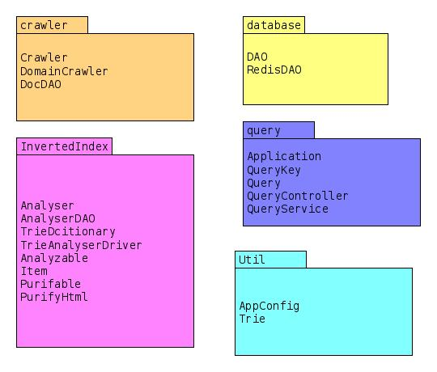
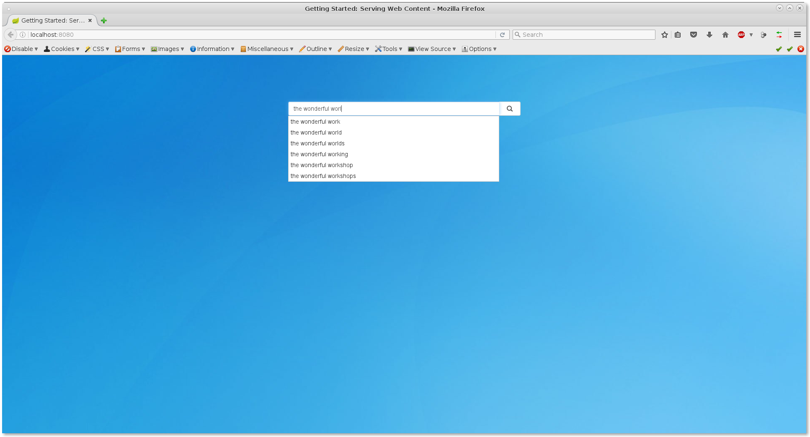
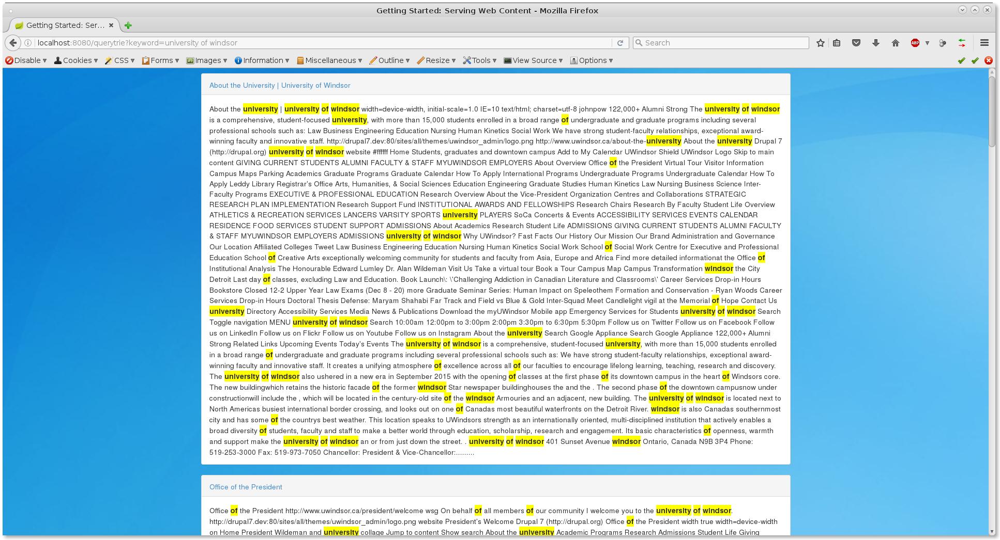

# searchingEngine
this project is a maven project, download the package and decompress the file.
open the eclipse. right click the package explore window and select import. 
choose maven existing project.
then there you go.

this project has finished. it has following features
this project contain four main package.
1, database -- the main database class.
2, webcrawler -- the main module to grab the webpage from website. domain
  will crawl a domain;
3, invertedIndex -- the analysis package. purify html and build trie and save
  result back to database;
4, query - it use spring boot and thymeal template engine to generate webpage
 

the config file is located
 /app.conf where you can change database connection string and many other

to run locally
 src/main/java/query/Application.java is the main fucntion, it will start an
 embed http server with port 8080 default. then go to browser http://localhost:8080
 to view the page.

to crawl
 src/main/java/crawler/DomainCrawler.java

to analyse
  src/main/java/analyse/TrieAnaylserDriver.java

after running

searching result

invertedIndex table

Document in DataBase: 
It should save as sorted set;

term uses sorted set in redis database.
the format looks like
ZADD keyword frequency documentID:postion1:postion2:postion3 

for example 
ZADD the 3 98:1:20:31 //this means "the" shows up 3 times in document with id 98 and the index of the positions are 1,20,31

redis windows version download link
https://github.com/MSOpenTech/redis/blob/win2.8.12/bin/release/redis-2.8.12.zip

for more information contact me by brucelau.email@gmail.com
